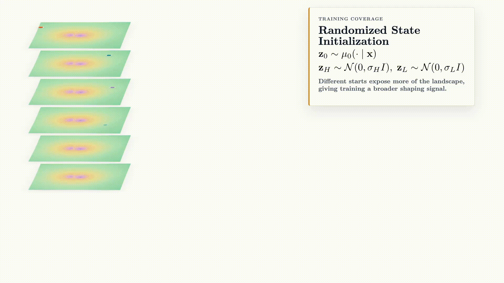
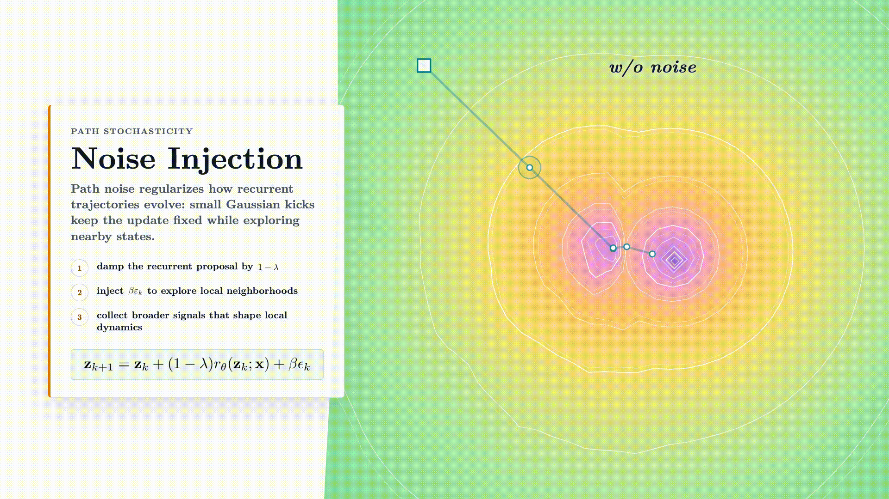

<h1 align="center" style="display: flex; align-items: center; justify-content: center; gap: 0.35em;">
  
  Equilibrium Reasoners
</h1>

<p align="center">
  <strong>Learning Attractors Enables Scalable Reasoning</strong>
</p>

<p align="center">
  <a href="https://huskydoge.github.io/">Benhao Huang</a>
  ·
  <a href="https://gsunshine.github.io/">Zhengyang Geng</a>
  ·
  <a href="https://zicokolter.com/">Zico Kolter</a>
  <br/>
  CMU
</p>

<p align="center">
  <a href="https://arxiv.org/abs/2605.21488"></a>
  <a href="https://huggingface.co/locuslab/EqR-model"></a>
  <a href="https://huggingface.co/datasets/locuslab/EqR-data"></a>
</p>

Code for reproducing EqR experiments on Sudoku-Extreme and Maze-Unique.

<p align="center">
  
  
</p>

## Setup

```bash
uv venv
source .venv/bin/activate
uv pip install -r requirements.txt
```

`adam-atan2` must install its CUDA backend (`adam_atan2_backend`); a
Python-only install is not sufficient for training. Build it in an environment
where CUDA and Python headers are available:

```bash
# If CUDA is not already configured, point CUDA_HOME at the active CUDA
# toolkit. For example:
# export CUDA_HOME="$(dirname "$(dirname "$(which nvcc)")")"
# export PATH="$CUDA_HOME/bin:$PATH"

# Optional: set this when building without visible GPUs or when cross-compiling.
# Examples: H100=9.0, A100=8.0, RTX 4090/L40=8.9.
# export TORCH_CUDA_ARCH_LIST=9.0

python -m pip install --no-build-isolation --no-cache-dir --force-reinstall \
  adam-atan2==0.0.3
python - <<'PY'
from adam_atan2 import AdamATan2
import adam_atan2_backend
print(AdamATan2, adam_atan2_backend.__file__)
PY
```

Maze training also requires FlashAttention on CUDA.

<details>
<summary>FlashAttention install notes</summary>

EqR follows the HRM attention import pattern: prefer FlashAttention-3 via
`flash_attn_interface` when available, and fall back to FlashAttention-2 via
`flash_attn`. On NVIDIA Hopper GPUs, FlashAttention-3 is recommended. If a
local wheel is available:

```bash
python -m pip install --no-deps <path-to-flash-attn-3-wheel.whl>
python - <<'PY'
import flash_attn_interface
print(flash_attn_interface.__file__)
PY
```

If FlashAttention-3 is unavailable, install FlashAttention-2:

```bash
python -m pip install flash-attn --no-build-isolation
python - <<'PY'
from flash_attn import flash_attn_func
print(flash_attn_func)
PY
```

</details>

For W&B defaults, copy `config/secrets.example.yaml` to `config/secrets.yaml`
and fill in your entity/project. `config/secrets.yaml` is ignored by git.

## Data

Default dataset paths:

| Dataset | Path |
| --- | --- |
| Sudoku-Extreme | `data/sudoku-extreme-1k-aug-1000` |
| Maze-Unique | `data/maze-30x30-unique-1k` |

Download datasets:

```bash
bash scripts/download_artifacts.sh
```

Download datasets and pretrained checkpoints:

```bash
bash scripts/download_artifacts.sh --with-ckpts
```

The helper downloads Hugging Face snapshots under `downloads/eqr-artifacts`,
copies datasets into `data/`, and copies checkpoints into
`downloaded_checkpoints/`.

Checkpoint paths:

```text
downloaded_checkpoints/sudoku-extreme/eqr.pth
downloaded_checkpoints/maze-unique/eqr.pth
```

### Optional: rebuild datasets

<details>
<summary>Dataset rebuild commands</summary>

Use these commands only if you want to regenerate the datasets instead of
downloading `locuslab/EqR-data`.

Sudoku-Extreme follows the
[sapientinc/HRM](https://github.com/sapientinc/HRM) setup. The builder downloads
`train.csv` and `test.csv` from `sapientinc/sudoku-extreme`, converts them to
HRM/EqR-compatible NumPy arrays, and augments only the training split with
Sudoku-preserving digit, row, column, and transpose transformations.

Default EqR/HRM small-sample dataset:

```bash
python -m dataset.build_sudoku_dataset \
  --output-dir data/sudoku-extreme-1k-aug-1000 \
  --subsample-size 1000 \
  --num-aug 1000 \
  --seed 42
```

Full Sudoku-Extreme dataset:

```bash
python -m dataset.build_sudoku_dataset \
  --output-dir data/sudoku-extreme-full \
  --seed 42
```

The generated directory should contain `train/`, `test/`, and
`identifiers.json`. Each split contains `dataset.json` plus
`all__inputs.npy`, `all__labels.npy`, `all__puzzle_identifiers.npy`,
`all__puzzle_indices.npy`, and `all__group_indices.npy`.

Additional Sudoku-Extreme options:

```bash
python -m dataset.build_sudoku_dataset --help
```

Build Maze-Unique:

```bash
python dataset/build_maze_unique_dataset.py \
  --output-dir data/maze-30x30-unique-1k \
  --grid-size 30 \
  --train-samples 1000 \
  --test-samples 1000 \
  --maze-mode perfect \
  --length-distribution uniform \
  --min-path-length 100 \
  --max-path-length 140 \
  --require-unique \
  --dedupe
```

</details>

## Training

`scripts/train.sh` launches `torchrun --standalone` with one local process by
default. Override `NPROC_PER_NODE` only when you want multi-GPU training:

```bash
bash scripts/train.sh eqr_sudoku
bash scripts/train.sh trm_sudoku
bash scripts/train.sh eqr_maze_unique
bash scripts/train.sh trm_maze_unique

NPROC_PER_NODE=2 bash scripts/train.sh eqr_maze_unique
```

| Dataset | Config | Steps |
| --- | --- | ---: |
| Sudoku-Extreme | `config/train/eqr_sudoku.yaml` | 50k |
| Sudoku-Extreme TRM baseline | `config/train/trm_sudoku.yaml` | 50k |
| Maze-Unique | `config/train/eqr_maze_unique.yaml` | 100k |
| Maze-Unique TRM baseline | `config/train/trm_maze_unique.yaml` | 100k |

## Evaluation

`scripts/eval.sh` uses `config/eval/depth_breadth.yaml`. By default it runs
depth 16 with breadth 1.

```bash
bash scripts/eval.sh /path/to/checkpoint.pth
bash scripts/eval.sh /path/to/checkpoint.pth halt_max_steps=64
bash scripts/eval.sh /path/to/checkpoint.pth \
  halt_max_steps=64 different_init=128 convergence_top_k=1 global_batch_size=16
```

After downloading checkpoints, evaluate the pretrained EqR models:

```bash
bash scripts/eval.sh downloaded_checkpoints/sudoku-extreme/eqr.pth
bash scripts/eval.sh downloaded_checkpoints/maze-unique/eqr.pth
```

Evaluation config:

```text
config/eval/depth_breadth.yaml
```

## TODO

- Release XLA code for large-scale inference.

## Acknowledgements

This codebase builds on the [HRM](https://github.com/sapientinc/HRM) and
[TRM](https://github.com/SamsungSAILMontreal/TinyRecursiveModels) repositories.

## License

This project is released under the Apache License 2.0. See [LICENSE](LICENSE)
for details.

## Citation

```bibtex
TODO
```
