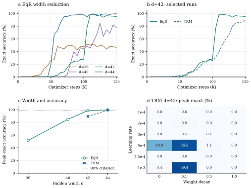

# Maze-Unique at Small Parameter Budgets

## Findings

The EqR paper's Maze-Unique hyperparameter search was limited.
Our broader tuning achieves **100% validation exact accuracy with a smaller EqR
model**, motivating a search for the minimum capacity needed to solve the task.

At hidden width **d=42 (39.9K core parameters)**, EqR reaches **98.6% peak / 95.2% final**,
versus **89.4% / 89.4%** for TRM after 24 LR/WD trials. EqR retains an accuracy
advantage at this parameter budget. The tested widths place the transition to
99% accuracy between d=42 and d=44. These findings motivate broader tuning of
both proposed methods and baselines before making performance or capacity claims.



Unsmoothed EMA curves for individual selected runs, their peak scores, and
the complete 24-cell TRM d=42 sweep.

## Results

| Model | d | Heads | Core parameters | Selected LR | WD | Peak exact | Peak step | Last exact | Last step |
| --- | ---: | ---: | ---: | ---: | ---: | ---: | ---: | ---: | ---: |
| EqR | 36 | 2 | 33.3K | 2e-3 | 0.1 | 51.7% | 115K | 46.5% | 150K |
| EqR | 40 | 2 | 37.7K | 3e-3 | 0.1 | 84.8% | 125K | 77.6% | 150K |
| **EqR** | **42** | **3** | **39.9K** | **1e-3** | **0.1** | **98.6%** | **115K** | **95.2%** | **150K** |
| TRM | 42 | 3 | 39.9K | 1e-3 | 0.1 | 89.4% | 150K | 89.4% | 150K |
| EqR | 44 | 2 | 42.2K | 1e-3 | 0.1 | 99.6% | 150K | 99.6% | 150K |
| TRM | 44 | 2 | 42.2K | 1e-3 | 0.1 | 99.4% | 95K | 99.4% | 95K |

For d=42, we use three attention heads so each head has an even dimension
(42 / 3 = 14), as required by the current RoPE implementation.

TRM d=44 stopped at 95K after crossing 99%; EqR d=44 first crossed 99% at 115K.
Core counts are rounded to 0.1K; the separately optimized puzzle table adds
d scalars.

### Other controls

- **EqR d=64, 66.4K core parameters:** 100% at 90K, 99.8% at 100K;
  LR=1.5e-3, WD=0.1.
- **EqR d=128, 263.9K core parameters:** 100% at 100K, then stopped;
  LR=3e-4, WD=0.5. It uses noise=0.1 and four GPUs at GBS 768, unlike the
  small-width comparison's noise=0.01 and one GPU.
- **HRM d=24, 41.8K core parameters:** 0% peak and last exact accuracy across
  nine LR/WD trials with a 150K training budget: LRs {5e-4, 1e-3, 2e-3}
  crossed with WDs {0, 0.01, 1.0}.

The figure covers the EqR/TRM width study; the CSV exports and reproduction
launcher also include the d=128 control.

## Sweeps

| Model / widths | Learning rates | WD | Included evidence |
| --- | --- | --- | --- |
| EqR d=36, 40, 44 | 1e-3, 2e-3, 3e-3, 4e-3 | 0.1 | Selected 150K runs; some other candidates pruned |
| EqR d=42 | 7.5e-4, 1e-3, 1.25e-3, 1.5e-3 | 0.1 | All 4 runs through 150K |
| TRM d=44 | 5e-4, 1e-3, 2e-3, 3e-3, 4e-3 | 0.1 | Selected run through its 95K stop |
| TRM d=42 | 1e-4, 2e-4, 3e-4, 5e-4, 7.5e-4, 1e-3 | 0, 0.1, 0.5, 1.0 | All 24 runs through 150K |
| HRM d=24 | 5e-4, 1e-3, 2e-3 | 0, 0.01, 1.0 | 9 runs; 150K budget |

EqR d=42 peaks at 0%, 98.6%, 7.1%, and 0% in ascending LR order. Both models
are sensitive to tuning. The best TRM d=42 LR is at the grid's upper edge.

## Reproduce

```bash
DRY_RUN=1 bash supplements/maze_unique/sweep.sh trm-h42 21

# Run independently, each on one GPU.
bash supplements/maze_unique/sweep.sh eqr-h42 1
bash supplements/maze_unique/sweep.sh trm-h42 21
bash supplements/maze_unique/sweep.sh hrm-h24 0 
```

## Data and Checks

[results.csv](results.csv) records 33 run summaries, settings, and source-log
hashes; [curves.csv](curves.csv) contains their 969 evaluation points.
